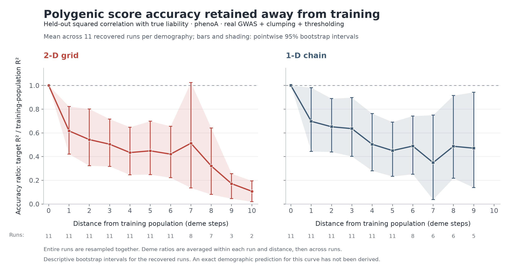

# Accuracy ratio by distance, with confidence intervals



This figure reconstructs the held-out accuracy-ratio curve for the real P+T
simulation's 2-D grid and 1-D chain. It uses 22 recovered run summaries: seeds
1–10 and 96 for each demography, containing 506 population-level measurements.
The plotted phenotype is `phenoA`.

At each target population, accuracy is the squared Pearson correlation between
the deployed score and `true_liab`, measured on held-out individuals. Divide by
the same run's training-population held-out accuracy. First average these ratios
over populations at a given distance **within each run**, then average the
available runs equally. This is a mean of ratios, not a ratio of mean accuracies.
The distance-zero ratio is exactly one in every run.

Distance means population steps in the simulated chain or grid. It is not F_ST.
Because the training population is randomly chosen, some runs have no populations
at the largest distances. The figure gives the number of contributing runs at
each distance. Consequently, each distance estimates a mean conditional on that
distance existing in the simulated run; the mixture of training locations can
change across distances.

## Confidence intervals

**Correction:** the claim that the expectation relevant to this figure had been
established as infinite is withdrawn. The [audit](../portability_expectation/AUDIT.md)
explains the gap between the conditional ratio analysis and the requested
simulation law. No exact demographic prediction has been derived. The ratio
bars describe bootstrap resampling of the recovered-run means; a population
confidence-interval interpretation requires appropriate sampling and moment
assumptions that have not been established for these retained files.

Bars and shading are pointwise 95% percentile bootstrap intervals
from 50,000 resamples, with RNG seed 20260910. Resampling is by complete simulation
run within demography, keeping populations that share the trained score and
source denominator together. For a distance absent from an entire bootstrap
sample, that sample does not contribute to that distance's percentile estimate;
the exact count is recorded in `confidence_intervals.csv`.

These intervals are not prediction intervals for individual runs, simultaneous
confidence bands, or exact theoretical bounds. The absolute-accuracy endpoint
is bounded; its bars retain the usual approximate bootstrap interpretation,
subject to the small sample and recovery limitations below.
The farthest grid distance has only two recovered runs; its interval is especially
unreliable with so few independent observations. The recovered runs are an available
subset, not a newly generated or prospectively selected simulation batch. No claim
is made that retention of these files was statistically random.

## Reproduce

From this directory, with Python 3.13 and `uv` installed:

```sh
uv run --with-requirements requirements.txt python plot_portability_ci.py
```

The script reads the archived TSV summaries directly, checks each run against its
metadata, verifies consistent recorded protocol fields, and emits:

- `accuracy_ratio_by_distance_95ci.png` and `.pdf`: target/source accuracy ratio.
- `accuracy_by_distance_95ci.png` and `.pdf`: absolute target accuracy.
- `per_deme_accuracy.csv`: source accuracy, target accuracy, ratio and distance.
- `per_seed_distance.csv`: the within-run aggregates used for inference.
- `confidence_intervals.csv`: means, intervals, run counts and bootstrap counts.
- `provenance.json`: source fingerprints, snapshot location and calculation details.

## Recovered source

`inputs.tar.gz` contains unmodified simulation summaries and JSON run metadata
read from the MSI snapshot:

```
/projects/standard/hsiehph/sauer354/.snapshot/snapshot_2026-08-16_00_00_00_UTC/gnomon/sims/results_hpc/ancestry_calibration/data
```

The metadata includes seeds 1–96, but per-deme summaries survive here only for
1–10 and 96. Missing correlations are not replaced by rounded slope metadata.
No new simulation, curve fit, or digitization of plotted points is used.

The previously opened `best4_rawpgs_vs_fst.png` is a different experiment: its
original producer, `redo2.py`, averaged pooled raw-PGS performance across a
migration-parameter sweep. It did not calculate confidence intervals, and its
`fst` helper pooled the available F_ST metadata across both demographies. The
producer was located in the September 8 snapshot, but its migration-sweep data
directories were not found in the retained snapshots. **This bundle reconstructs
the requested accuracy-ratio-versus-distance experiment; it is not that earlier
image with error bars added.**
